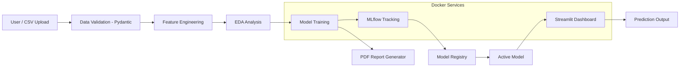
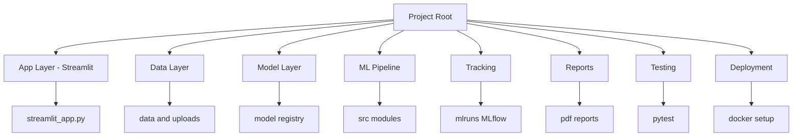
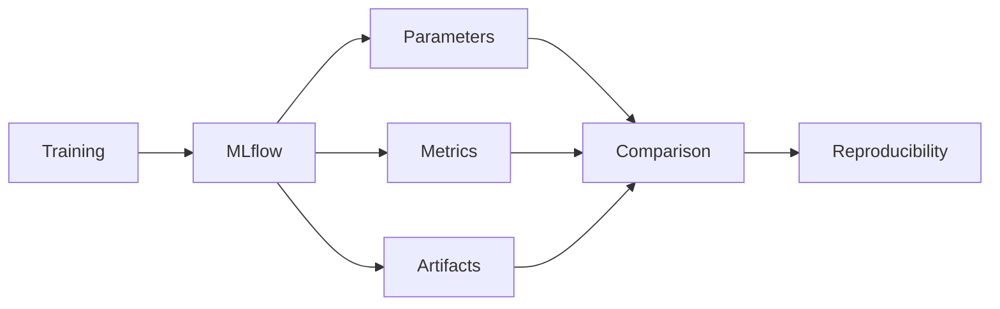
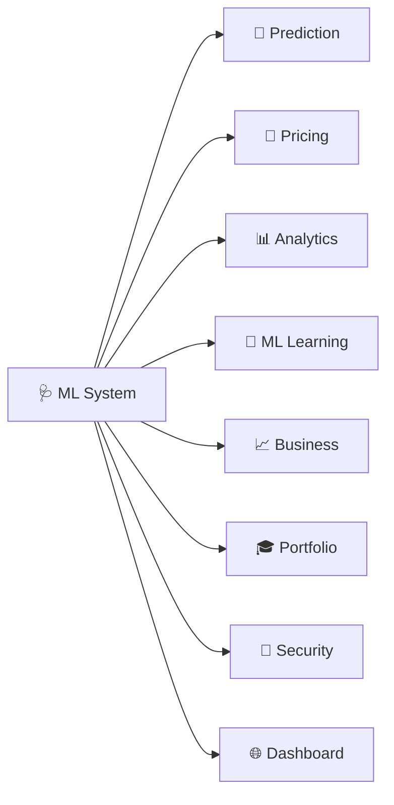
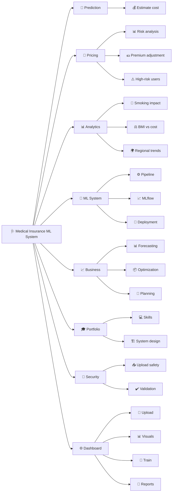

# 🩺 Medical Insurance Cost Prediction — Advanced ML Project

<p align="center">


</p>

> A **production-grade end-to-end Machine Learning pipeline** to predict medical insurance costs with full lifecycle support — from data validation to deployment.

---

## 🚀 Overview

This project is designed to simulate a **real-world ML system**.  
It covers the complete pipeline including:

* Data ingestion & validation  
* Feature engineering  
* Multi-model training  
* MLflow experiment tracking  
* Model registry (version control)  
* Streamlit dashboard  
* Automated PDF reports  
* Dockerized deployment  

---

## 🎥 Live Demo

<p align="center">
  
</p>

---

## 📸 Screenshots

### 🏠 Dashboard Home

--

### 🔮 Prediction Page

--

### Dataset Manager

---

### 📊 EDA Insights

---

### Train Models

---

### 🗂 Model Registry

---

### 📑 Reports

----


> 📌 Store images inside: `app/screenshots/`

---

## 📊 Architecture Diagram



---

## ✨ Features

| Feature                 | Description                                   |
|------------------------|-----------------------------------------------|
| 🐳 Docker Deployment    | Run entire system with one command            |
| 📊 EDA Visualizations   | Medical-style insights using Seaborn & Plotly |
| 🤖 Multi-Model Training | 6 ML models with hyperparameter tuning        |
| 📈 MLflow Tracking      | Track experiments, metrics, parameters        |
| 🗂 Model Registry       | Versioned models with active model switching  |
| 📑 PDF Reports          | Auto-generated model + dataset reports        |
| 📂 CSV Upload           | Real dataset upload with validation           |
| 🔐 Security             | Safe file handling + path protection          |
| 🌐 Streamlit Dashboard  | 7-page interactive UI                         |
| 🧪 Testing              | Pytest-based test suite                       |

---

## 📁 Project Structure

## 📁 Project Structure (With Explanation)

```
medical_insurance_project/
│
├── app/                          # 🌐 Streamlit web application
│   └── streamlit_app.py          # 🎛️ Multi-page dashboard (Predict, EDA, Train, Registry, Reports)
│
├── data/                         # 📂 Data storage
│   ├── medical_insurance.csv     # 📊 Default dataset
│   └── uploads/                  # 📥 User-uploaded CSV files (validated & safe)
│
├── models/                       # 🤖 Trained models storage
│   └── registry/                 # 🗂 Model registry (versioned models + active model)
│
├── reports/                      # 📑 Auto-generated PDF reports
├── mlruns/                       # 📈 MLflow experiment tracking logs
│
├── src/                          # 🧠 Core ML pipeline (main logic)
│   ├── paths.py                  # 🔐 Secure file paths (prevents path traversal)
│   ├── data_loader.py            # 📥 Load & validate data (Pydantic schema)
│   ├── preprocessing.py          # 🧹 Feature engineering & transformations
│   ├── eda.py                    # 📊 Data visualization (EDA plots)
│   ├── train.py                  # 🤖 Model training & evaluation
│   ├── registry.py               # 🗂 Model versioning & management
│   └── report.py                 # 📑 PDF report generation
│
├── tests/                        # 🧪 Unit tests (pytest)
│
├── Dockerfile                    # 🐳 Docker image configuration
├── docker-compose.yml            # ⚙️ Multi-service setup (app + trainer + MLflow)
├── requirements.txt              # 📦 Python dependencies
└── README.md                     # 📘 Project documentation
```


## 📊 System Structure Overview



---

## 🔄 ML Pipeline

1. Data Loading & Validation  
2. Feature Engineering  
3. Exploratory Data Analysis  
4. Model Training & Evaluation  
5. Experiment Tracking (MLflow)  
6. Model Registration  
7. Deployment (Streamlit)  
8. Report Generation  

---

## 🧠 Feature Engineering

* `smoker_bmi` → captures combined risk  
* `age_smoker` → interaction feature  
* BMI categories  
* Age groups  

✔ Improves prediction accuracy  

---

## 📊 Model Training

Models used:

* Linear Regression  
* Ridge Regression ⭐ (Best)  
* Lasso Regression  
* Random Forest  
* Gradient Boosting  
* XGBoost  

### 🏆 Best Model
- **Ridge Regression**
- **R² ≈ 0.86**

---

## 📈 MLflow Tracking

MLflow is used to track and manage experiments across the ML lifecycle:

- Logs parameters, metrics, and artifacts  
- Enables comparison of multiple experiments  
- Ensures reproducibility of results  


### 🔍 Workflow



---

## 🗂 Model Registry

A built-in model registry enables seamless model lifecycle management:

- Version-controlled model storage  
- Metadata tracking (accuracy, parameters, timestamps)  
- Dynamic active model switching  

The Streamlit dashboard always uses the currently active model for real-time predictions.
---

## 🌐 Streamlit Dashboard

Pages:

* 🏠 Home  
* 🔮 Predict  
* 📂 Dataset  
* 📊 EDA  
* ⚙️ Train  
* 🗂 Registry  
* 📑 Reports  

---

## 📑 Automated Reports

Generated using `fpdf2`, including:

- 📊 Dataset summary  
- 📈 Statistical insights  
- 🤖 Model comparison  
- 📉 EDA visuals  

## 🐳 Docker Setup

```bash
docker compose up --build
```

### Services:

* Trainer  
* Streamlit App → localhost:8501  
* MLflow UI → localhost:5000  

---

## 💻 Local Setup

```bash
pip install -r requirements.txt

python -m src.eda
python -m src.train
python -m src.report

streamlit run app/streamlit_app.py
```

---

## 🔐 Security

Security is enforced throughout the data pipeline:

- Validates uploaded files  
- Applies schema validation (Pydantic)  
- Stores files in restricted directories  
- Prevents path traversal attacks  

### 🔒 Workflow


---

## 🧪 Testing

```bash
pytest
```

---

## 📊 Use Cases Overview



## 📊 Use Cases Diagram



## 📌 Conclusion

End-to-end ML system covering:

**Data → Model → Deployment → Monitoring**

---

## 👨‍💻 Author

👨‍💻 **Pankaj Kumar**  
🎯 Aspiring Data Scientist  

💼 Skills:  
📊 Machine Learning | 📈 Data Analysis | 🧠 AI  

🚀 Focus:  
Building scalable, production-ready ML systems 

---

## ⭐ Support

If you like this project, give it a ⭐ on GitHub!
